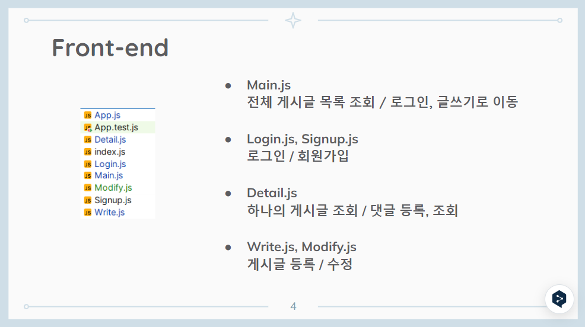
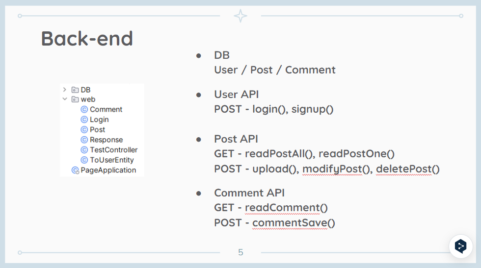

# 게시판 만들기

 개발 기간 24.04.04 ~ 24.04.17

---

### 기능

- 회원가입/로그인 (Session 사용)
- 게시물
    - 등록/조회/수정/삭제
- 댓글
    - 등록/조회/(수정/삭제 - 추가예정)

---
### 아키텍쳐
Front-end : React

Css : Bulma

Back-end : Spring-boot

DB : MySQL

---
### API List

#### User
- POST
  - /login/welcome
  - /signup/welcome

#### 게시글
- GET
  - /main : 전체 게시글 목록 조회
  - /{index} : 하나의 게시글 정보를 조회
- POST
  - /write/send : 게시글 작성
  - /{index}/modify/send : 게시글 수정
  - /{index}/delete : 게시글 삭제

#### 댓글
- GET
  - /{index}/getCmt
- POST
  - /{index}/sendCmt
---
### DB Entity
User / Post / Comment

JPA Repository를 활용해 CRUD 구현

---
### Front-end 구성

---
### Back-end 구성

---
### 개선점
ERD 개선: 현재 n:1 관계는 적용되지 않고 있어 @OneToMany 등을 활용할 예정

Session : 세션으로 서버와 인증 소통은 하지 않고 있어 이 점을 개선하려 함